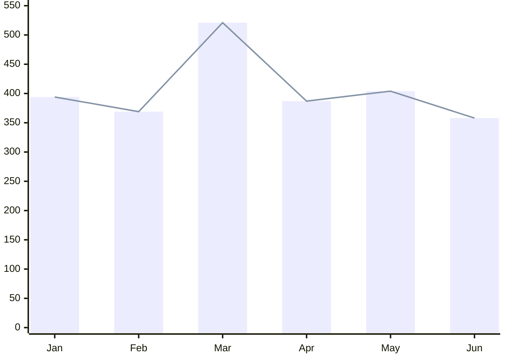
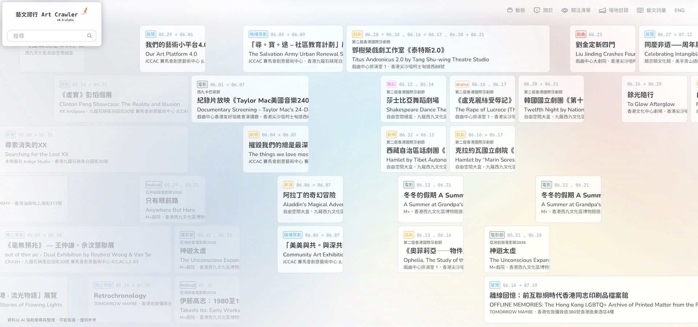

# HK Art Listing
**A open, public database of contemporary art events in Hong Kong**   
**香港當代藝術活動公開數據庫**

 

Art event information in Hong Kong is highly fragmented, scattered across countless social media platforms, venues, and organiser websites. This project systematically aggregates this information and transforms it into standardised Open Data, making it accessible for public development, creative work, and academic research. The project is built around the following core principles.

香港的藝術活動資訊非常零散，分佈在無數社交媒體、場地平台和主辦網站。本項目對其進行系統性整合，並轉化為標準化的開放數據（Open Data），便於開發、創作及學術研究。項目圍繞以下核心原則構建。

- **Open Access 開放使用** Making art event data easier to find and access across Hong Kong. Making the data freely available for anyone to use, with clear licensing.  打破資訊碎片化，讓全港藝文數據更易查閱、流通。以明確的授權條款，讓數據免費供任何人使用。

- **Standardisation 統一格式** Fixing messy data and formatting issues from different platforms.  統一數據規範，解決各個平台資料格式不一的問題。

- **Public Provenance 公開來源** Ensuring all data entries are traceable to verifiable public sources.  確保所有數據條目都可追溯到可驗證的公開來源。

- **Continuous Updates 持續更新** Regularly updating the database to reflect new events and changes.  定期更新數據庫，以反映新活動的加入和現有活動的變更。

  

### Monthly Event Count 每月活動數量 (2026)

 
## Data Pipeline 數據處理

1. **Primary Source Ingestion 第一方來源**  
Data is fetched directly from organisers' official websites and social media channels, venue platforms. Third-party listings and event calendars are used only as a fallback if they are the sole source of information for a given event.    
數據選自主辦方官方網站及社交媒體、場地平台。僅在該活動無其他官方資訊來源時，方會採用第三方列表及活動日曆作為後備數據源。

2. **Extraction 數據提取**  
Employs automated web scraping for standardised domains; non-standard formats (e.g., Instagram) are handled via manual data processing.   
標準結構之網站採用自動化網頁爬取；非標準格式（如 Instagram）則由人工處理。

3. **Parsing & Validation 解析與驗證**  
Large Language Models (LLMs) are utilised to parse and clean unstructured event descriptions into standardised metadata. The validated data is then compiled and exported in both JSON and CSV formats.   
運用大型語言模型（LLM）將非結構化的活動描述進行語義解析與清洗，轉化為標準化的元數據。通過驗證的數據會同時編譯並匯出為 JSON 與 CSV 兩種格式。

 

**Copyright & IP Note 版權與知識產權聲明**  
The intellectual property of all original descriptive text, imagery, and event details remains exclusively with the upstream creators, artists, and organising institutions.  
原始活動描述、圖像及活動細節之知識產權，完全歸屬上游創作者、藝術家及主辦機構所有。

 

## Data Format 資料格式說明

This project provides symmetrical JSON and CSV files. All text fields (such as event titles, venues, and addresses) use a bilingual design aligned across Traditional Chinese (`_zh`) and English (`_en`). If the event organiser did not provide English details, the respective field will be left as an empty string `""`.

本項目提供對稱的 JSON 與 CSV 格式檔案。所有文字欄位（如活動名稱、場地及地址）均採雙語（繁體中文 `_zh` 與英文 `_en`）對齊設計，若主辦方未提供英文資訊，則該欄位會保留為空字串 `""`。

| Field Name 欄位 | Type 類型 | Description 說明 |
| :--- | :--- | :--- |
| `id` | `String` | Unique identifier (UUID).   唯一識別碼 (UUID)。 |
| `category` | `String` | Hierarchical activity category tag.    多級活動分類標籤。 |
| `title_zh` | `String` | Event name in Traditional Chinese.    活動中文名稱。 |
| `title_en` | `String` | Event name in English.    活動英文名稱。 |
| `opening_periods` | `String` | Exhibition dates or screening schedules. Date ranges are connected by `~`; single days or separate sessions are split by `/`.   展期或放映日期。期間以 `~` 連接，單日或分段放映以 `/` 隔開。  *(e.g., `"2026-01-10~2026-03-15"` or `"2026-01-09 / 2026-01-23")* |
| `websites` | `Array` | List of source URLs from organisers.    原始數據來源網址（可包含多個官方連結）。 |
| `venue_zh` | `String` | Venue name in Traditional Chinese.    中文場地名稱。 |
| `venue_en` | `String` | Venue name in English.    英文場地名稱。 |
| `address_zh` | `String` | Detailed address in Traditional Chinese.    中文詳細地址。 |
| `address_en` | `String` | Detailed address in English.    英文詳細地址。 |
| `district` | `String` | Geographic district code for regional filtering.    地區代碼（用於分區篩選）。 |

 

### Reference 參考資料

District Code 地區代碼

| Code 代碼 | Description 說明 |
| :--- | :--- |
| `hk_central_west` | 港島中西區 Hong Kong Island Central and Western District |
| `hk_south` | 港島南區 Hong Kong Island Southern District |
| `hk_east` | 港島東區 Hong Kong Island Eastern District |
| `hk_wan_chai` | 港島灣仔區 Hong Kong Island Wan Chai District |
| `kl_west` | 九龍西區 Kowloon West District |
| `kl_east` | 九龍東區 Kowloon East District |
| `kl_central` | 九龍中區 Kowloon Central District |
| `nt` | 新界 New Territories |
| `islands` | 離島 Islands |

<!-- Future additions: 
## Directory 來源目錄

To be added.
待補充
-->

 

## ArtCrawler 藝文爬行 (https://todoma.in/artcrawler/)

**ArtCrawler** is an external frontend extension of the **hk-art-listings** project. It transforms background raw open data into an intuitive, visual experience, serving as a search and navigation interface for art events across Hong Kong.

**ArtCrawler** 是 **hk-art-listings** 項目外的延伸應用，把後台的原始開放數據轉化成直觀、可視化的前端用戶體驗，作為全港藝術活動的檢索與導航介面。

 

## Want to Help? 歡迎幫忙
- **Fix Typos/Errors 資料修正:** Spot a wrong date, a broken link, or a typo? Open an Issue to let us know. 發現日期錯誤、連結失效或錯字？請提交 Issue 通知我們。
- **No Pull Request 不接受 Pull Request:** To maintain data integrity and provenance, no direct Pull Requests are accepted. 為了維護數據的完整性和來源，項目並不接受直接的 Pull Requests。
- **Contact Us 聯繫:** If you have suggestions for improving the database design, or want to contribute data, please reach out! 如果你對資料庫設計有改進建議，或想貢獻數據，請與我聯繫。

 

## License 授權
This work is licensed under a
[Creative Commons Attribution 4.0 International License][cc-by].

[![CC BY 4.0][cc-by-image]][cc-by]

[cc-by]: http://creativecommons.org/licenses/by/4.0/
[cc-by-image]: https://i.creativecommons.org/l/by/4.0/88x31.png
[cc-by-shield]: https://img.shields.io/badge/License-CC%20BY%204.0-lightgrey.svg

